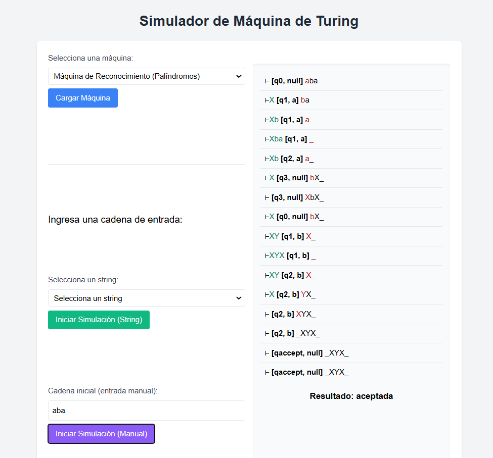
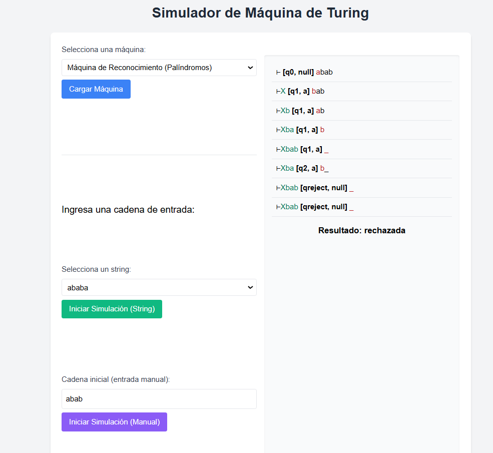
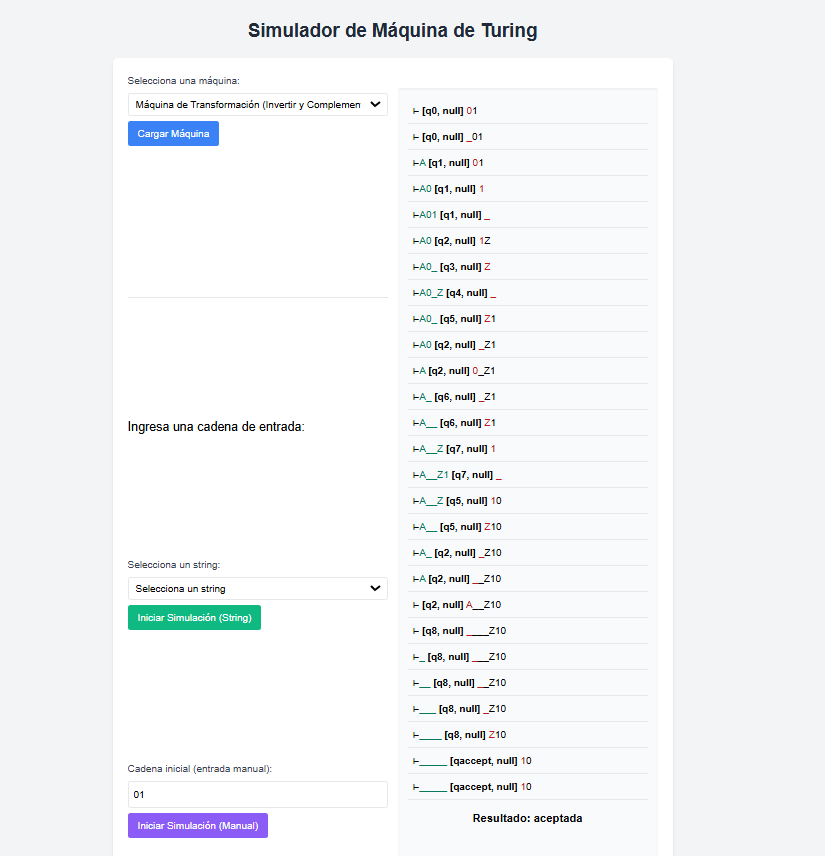

# TDC-PROYECTO3 (Máquina de Turing)

## Descripción
Este proyecto implementa dos Máquinas de Turing utilizando Python y Flask para simular su comportamiento en un entorno web:

1. **Máquina reconocedora**:
   - Identifica si \( w \) es una cadena de entrada es un palíndromo, siendo `{a,b}` el alfabeto de entrada.
2. **Máquina alteradora**:
   - Modifica una cadena binaria de entrada \( w \) para devolver su reverso.

El objetivo principal es modelar y visualizar el comportamiento de ambas máquinas utilizando configuraciones dinámicas y una interfaz web intuitiva.

---

## Requisitos previos

- Python 3.8 o superior
- Las siguientes bibliotecas de Python:

1. **pyyaml** (para cargar configuraciones YAML)
```bash
pip install pyyaml
```
2. **flask** (para poder visualizar el proyecto desde la web )
```bash
pip install flask
```
- **Clona el repositorio:**
   ```bash
   git clone https://github.com/alee2602/TDC-PROYECTO3.git
   cd TDC-PROYECTO3
   ```

---

## Estructura del proyecto 

```
TDC-PROYECTO3/
├── 📂 machines/                    
│   ├── alteringconfig.yaml         
│   └── recognitionconfig.yaml     
├── 📂 templates/                    
│   └── index.html                  
├── 📄 recognitiondata.txt          
├── 🔧 tape.py                      
├── 🔧 turing_machine.py           
├── 🔧 yaml_loader.py               
├── 🚀 main.py                     
└── 📝 README.md                                 

```

## Configuración

Ambas máquinas están definidas en archivos YAML que especifican:

- Estados (q_states).
- Alfabeto de entrada (alphabet) y alfabeto de la cinta (tape_alphabet).
- Valor en la memoria caché (mem_cache_value)
- Reglas de transición (delta).

### Ejemplo de configración de la máquina reconocedora 

```
q_states:
  q_list:
    - 'q0'    # Estado inicial
    - 'q1'    # Mover derecha
    - 'q2'    # Verificar último caracter
    - 'q3'    # Regresar
    - 'qaccept'
    - 'qreject'
  initial: 'q0'
  final: 
    - 'qaccept'

alphabet:
  - 'a'
  - 'b'

tape_alphabet:
  - 'a'
  - 'b'
  - '_'
  - 'X'
  - 'Y'

delta:
  # Estado inicial
  - params:
      initial_state: 'q0'
      mem_cache_value: null
      tape_input: 'a'
    output:
      final_state: 'q1'
      mem_cache_value: 'a'
      tape_output: 'X'
      tape_displacement: 'R'

```

### Ejemplo de configración de la máquina alteradora

```
q_states:
  q_list:
    - 'q0'
    - 'q1'
    - 'q2'
    - 'q3'
    - 'q4'
    - 'q5'
    - 'q6'
    - 'q7'
    - 'q8'
    - 'qaccept'
  initial: 'q0'
  final: 
    - 'qaccept'

alphabet:
  - '0'
  - '1'

tape_alphabet:
  - '0'
  - '1'
  - 'Z'
  - 'B'
  - 'A'
  - '_'

delta:
  # Estado inicial
  - params:
      initial_state: 'q0'
      mem_cache_value: null
      tape_input: '0'
    output:
      final_state: 'q0'
      mem_cache_value: null
      tape_output: '0'
      tape_displacement: 'L'

```

## Uso

### **1. Seleccionar la Máquina**
En la parte superior de la interfaz, encontrarás un menú desplegable con las opciones:
- **Máquina de Reconocimiento (Palíndromos)**: Verifica si una cadena es un palíndromo.
- **Máquina Alteradora**: Devuelve el reverso de una cadena binaria.

Selecciona la máquina que deseas simular y haz clic en el botón **Cargar Máquina**.

### **2. Ingresar una Cadena**
Tienes dos formas de ingresar una cadena:
- **Seleccionar una cadena predefinida** desde el menú desplegable, y luego hacer clic en **Iniciar Simulación (String)**.
- **Ingresar manualmente** una cadena en el campo de texto de la sección *Cadena inicial (entrada manual)* y hacer clic en **Iniciar Simulación (Manual)**.

### **3. Ver los Pasos de la Simulación**
Una vez iniciada la simulación, se mostrarán los pasos que sigue la Máquina de Turing:
- La cinta actualizada después de cada transición.
- El estado actual de la máquina.
- La posición del cabezal.

### **4. Interpretar el Resultado**
Cuando la simulación termine, observarás si la cadena fue aceptada o rechazada para la máquina reconocedora, o el resultado alterado para la máquina alteradora.

### **Ejemplo de Ejecución**

#### **Ejemplo 1: Máquina de Reconocimiento**

- ✅ Entrada: aba → Aceptada (es palíndromo)



- ❌ Entrada: abab → Rechazada (no es palíndromo)



#### **Ejemplo 2: Máquina Alteradora**
- Entrada: 01 → Salida: 10



## Ejecución

Dentro de la carpeta del proyecto, ejecuta el siguiente comando:
```bash
python main.py
```
El proyecto se ejecutará en el local host: [http://127.0.0.1:5000/](http://127.0.0.1:5000/)

--- 

## 📺 Ver Video de Demostración

Pueder ver el video de demostración a continuación:

